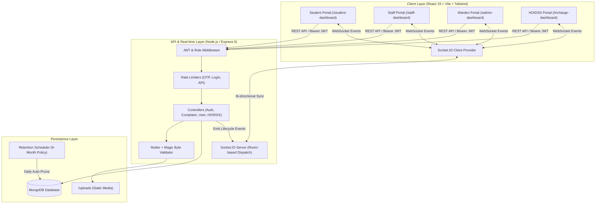
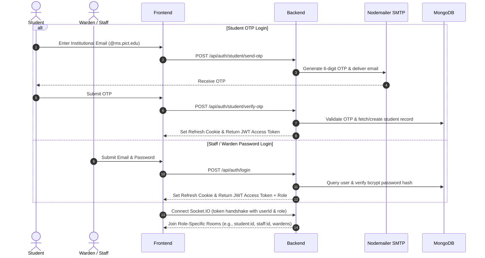
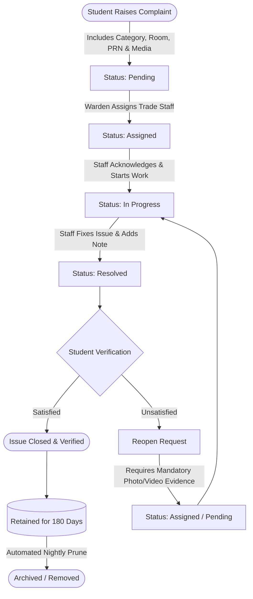

# Hostel Management System

[](https://reactjs.org/)
[](https://vitejs.dev/)
[](https://nodejs.org/)
[](https://expressjs.com/)
[](https://socket.io/)
[](https://www.mongodb.com/atlas)
[](https://tailwindcss.com/)
[](https://github.com/Antariksh62/Hostel-Management-System/blob/main/LICENSE)
[](https://github.com/Antariksh62/Hostel-Management-System/commits/main)
[](https://github.com/Antariksh62/Hostel-Management-System/stargazers)
[](https://github.com/Antariksh62/Hostel-Management-System/network)

---

## Table of Contents
- [Project Overview](#project-overview)
- [Key Highlights](#key-highlights)
- [Current Implementation Status](#current-implementation-status)
- [System Architecture](#system-architecture)
- [Authentication & Access Control Flow](#authentication--access-control-flow)
- [Complaint Lifecycle & Feedback Workflow](#complaint-lifecycle--feedback-workflow)
- [Real-Time Socket.IO Architecture](#real-time-socketio-architecture)
- [Tech Stack](#tech-stack)
- [Core Features by Role](#core-features-by-role)
- [Folder Structure](#folder-structure)
- [Installation & Running Locally](#installation--running-locally)
- [Environment Variables](#environment-variables)
- [API Reference](#api-reference)
- [Security & Compliance](#security--compliance)
- [Roadmap](#roadmap)
- [License](#license)

---

## Project Overview

**Hostel Management System (HMS)** is a modern full-stack MERN + Socket.IO web application designed to digitize and automate the complaint lifecycle, maintenance operations, and infrastructure analytics for collegiate hostels (e.g., PICT Hostel).

- **Problem it Solves**: Eliminates manual paper registers and fragmented complaint reporting. Provides students with transparent real-time tracking, empowers maintenance staff with structured task queues, grants wardens full operational triage, and provides senior management (HOIDSS / Incharge) with executive analytics and heatmaps.
- **Target Audience**: 
  - **Students**: Raise issues, attach evidence photos/videos, track live status, review resolution, and submit feedback.
  - **Maintenance Staff**: Trade-specific work queues (Electrician, Plumber, Carpenter, etc.), progress logging, and resolution submission.
  - **Wardens**: Direct triage, smart filtering (date, room, category, status), automated staff assignment, and maintenance oversight.
  - **Hostel Incharge / Senior Admin (HOIDSS)**: Institutional oversight, repeat issue detection, space heatmaps, staff SLA benchmarks, and predictive maintenance.

---

## Key Highlights

| Status | Feature | Description |
|:---:|---|---|
| ⚡ | **Real-Time Complaint Lifecycle** | Bi-directional Socket.IO updates across Student, Staff, Warden, and Incharge dashboards with zero page reloads. |
| 🛡️ | **Dual-Stream Authentication** | Passwordless institutional email OTP for Students (`@ms.pict.edu`) and secure JWT/bcrypt authentication for Staff, Wardens, and Admins. |
| 🔄 | **Feedback & Reopening Loop** | Students review resolved issues with a mandatory photographic/video proof requirement when marking work as unsatisfied. |
| 📸 | **Rich Media & Lightbox Viewer** | Up to 5 photos + 1 video per ticket with an interactive full-screen viewer supporting zoom (50%–350%), drag/pan, and playback. |
| 🧑‍🔧 | **Trade-Specific Assignment** | Direct staff directory organized by specialized maintenance trades (`Electrical`, `Plumbing`, `Carpentry`, etc.). |
| 📊 | **HOIDSS Executive Analytics** | Space heatmaps, repeat offender analysis, SLA breach monitors, and staff performance metrics. |
| 🗄️ | **Automated 6-Month Retention** | Immutable audit logs with automated background cleanup for resolved complaints older than 180 days. |
| 🌓 | **Modern Responsive UI** | Clean dark/light mode, compact collapsible navigation, and optimized layouts built with React 19, Tailwind CSS v4, and Radix UI. |

---

## Current Implementation Status

### Implemented Modules (100% Operational)
- [x] **Authentication & Authorization**: Student institutional OTP verification, Warden/Staff JWT authentication, token refresh cookies, role-based route protection.
- [x] **Real-Time Socket.IO Engine**: Live events for complaint creation, assignment, status transition, resolution, feedback reopening, and deletion broadcasts.
- [x] **Comprehensive Student Dashboard**: Ticket filing, room identification, PRN binding, live timeline view, and resolution feedback.
- [x] **Staff Workspace**: Active tasks, work progression, resolution note logging, and historical completion archive.
- [x] **Warden Command Center**: Multi-tier date filtering (Today, Yesterday, Last 7 days, Monthly, Custom range), category filtering, search, and staff assignment.
- [x] **Executive HOIDSS Dashboard**: Room heatmaps, maintenance breakdown, SLA tracking, Kanban board, and broadcast announcements.
- [x] **Evidence & Media Subsystem**: Multi-part uploads, MIME magic-byte validation, full-screen lightbox viewer with interactive zoom/pan controls.
- [x] **Automated Data Retention**: Scheduled daily cleanup removing resolved records older than 180 days while blocking manual complaint deletion for audit integrity.

---

## System Architecture



---

## Authentication & Access Control Flow



---

## Complaint Lifecycle & Feedback Workflow



---

## Real-Time Socket.IO Architecture

The system maintains real-time state synchronization across all connected dashboards via dedicated Socket.IO event channels:

| Event Name | Trigger Source | Payload | Target Recipients |
|---|---|---|---|
| `complaint:created` | Student raises a new ticket | Full complaint document + student PRN & room | All Wardens, Senior Management, Raising Student |
| `complaint:assigned` | Warden assigns complaint to staff | Updated ticket with assigned staff details | Assigned Staff, Raising Student, Wardens |
| `complaint:status-updated` | Staff starts work (`In Progress`) or resolves (`Resolved`) | Updated status, resolution note, timestamp | Raising Student, Wardens, Incharge |
| `complaint:reopened` | Student rejects resolution with unsatisfied feedback | Reopened complaint with student notes & evidence | Assigned Staff, Wardens, Incharge |
| `complaint:deleted` | Retention cleanup service | `complaintId` | All active dashboards |

---

## Tech Stack

### Frontend
- **Framework**: React 19 (`react` 19.2.4, `react-dom` 19.2.4)
- **Build Tool**: Vite 8.0.3 (`@tailwindcss/vite`)
- **Routing**: React Router 7.14.0
- **Styling**: Tailwind CSS v4.3.3 + Custom HMS Design Tokens
- **UI Primitives**: Radix UI (Dialog, Dropdown, Tabs, Popover, Select, Accordion, Tooltip)
- **State & Data Fetching**: TanStack React Query 5.100.10, Axios 1.14.0
- **Real-Time Client**: Socket.IO Client 4.8.3
- **Data Visualizations**: Recharts 2.15.4
- **Icons & Notifications**: Lucide React 1.8.0, Sonner 2.0.7

### Backend
- **Runtime & Framework**: Node.js 20+ (LTS) & Express 5.2.1
- **Real-Time Server**: Socket.IO 4.8.3 with JWT-authenticated socket handshake
- **Database & ODM**: MongoDB Atlas / Local with Mongoose 9.4.1
- **Security & Headers**: Helmet 8.1.0, CORS 2.8.6, Express Rate Limit 8.3.2
- **Authentication**: JSON Web Tokens (`jsonwebtoken` 9.0.3), `bcryptjs` 3.0.3, `cookie-parser` 1.4.7
- **Validation**: Joi 18.1.2 Schema Validator
- **File Upload & Verification**: Multer 2.1.1 + `file-type` 16.5.4 (magic-byte validation)
- **Email Delivery**: Nodemailer 8.0.5 (Gmail SMTP integration)
- **Logging**: Winston 3.19.0 logger

---

## Core Features by Role

### 👨‍🎓 Student Portal (`/student-dashboard`)
- **Passwordless Institutional Login**: OTP sent directly to student's `@ms.pict.edu` email.
- **Complaint Submission**: Report problems categorized by trade (`Electrical`, `Plumbing`, `Furniture`, `Cleanliness`, `Internet`, `Other`).
- **Media Upload**: Attach up to 5 photos and 1 video detailing the maintenance issue.
- **Real-Time Status Tracker**: Interactive step-by-step progress timeline (Submitted → Assigned → In Progress → Resolved).
- **Resolution Verification & Feedback**:
  - Accept fix to close the complaint.
  - Reject fix with **mandatory photo/video evidence** to automatically reopen the ticket for further work.
- **My Room**: View assigned room number, hostel wing, and room maintenance history.

### 🧑‍🔧 Maintenance Staff Portal (`/staff-dashboard`)
- **Assigned Tasks Queue**: Real-time listing of active tickets assigned to the logged-in technician.
- **Status Lifecycle Control**: Mark tickets as `In Progress` when starting work and `Resolved` upon completion.
- **Resolution Documentation**: Record mandatory resolution notes explaining actions taken.
- **Interactive Lightbox**: Inspect student evidence photos/videos with zoom, pan, and full video playback.
- **Work History**: Complete historical record of all completed maintenance jobs.

### 🛡️ Warden Management Portal (`/admin-dashboard`)
- **Comprehensive Complaint Registry**: Live overview of all hostel complaints with live counters for Pending, In Progress, and Resolved.
- **Smart Multi-Tier Filters**: Filter complaints by date (`Today`, `Yesterday`, `Last 7 Days`, `This Month`, `Last Month`, `Custom Range`), trade category, and status.
- **Staff Directory & Dispatch**: Assign complaints directly to registered staff members based on trade expertise.
- **Student Identification**: Every card and modal displays student Name, PRN Number (`f24ce307`), and Room Number.
- **Analytics & Trends**: Category breakdown charts, average resolution speed, and recurring problem indicators.

### 🏛️ Hostel Incharge / HOIDSS Executive Portal (`/incharge-dashboard`)
- **Space Heatmaps**: Visual floor-by-floor breakdown of complaint distribution.
- **SLA & Escalation Monitoring**: Track overdue complaints exceeding standard resolution windows.
- **Staff Performance Benchmarks**: Average turnaround time and resolution volume per staff member.
- **Broadcast Announcements**: Issue campus-wide or hostel-specific notices to residents.
- **Interactive Kanban**: Drag-and-drop workflow tracking across all active hostel operations.

---

## Folder Structure

```
Hostel-Management-System/
├── backend/
│   ├── config/
│   │   └── db.js                        # MongoDB Mongoose connection
│   ├── controllers/
│   │   ├── authController.js            # Staff/Warden login & registration
│   │   ├── complaintController.js       # Complaint CRUD, lifecycle, feedback, analytics
│   │   ├── inchargeDashboardController.js # HOIDSS executive metrics & heatmaps
│   │   ├── otpController.js             # Student OTP generation & verification
│   │   └── userController.js            # Profile, student & staff directory endpoints
│   ├── middleware/
│   │   ├── auth.js                      # JWT verification & role-based guards
│   │   ├── rateLimiter.js               # Express rate limiters for auth, OTP, API
│   │   ├── upload.js                    # Multer configuration & magic-byte validation
│   │   └── validate.js                  # Joi request schema validation
│   ├── models/
│   │   ├── Announcement.js              # Broadcast announcements schema
│   │   ├── Complaint.js                 # Complaint, statusHistory, feedback & media schema
│   │   ├── OTP.js                       # 6-digit OTP verification schema
│   │   ├── Room.js                      # Hostel room mapping schema
│   │   └── User.js                      # Student, Staff, Warden, Incharge user schema
│   ├── routes/
│   │   ├── authRoutes.js                # /api/auth routes
│   │   ├── complaintRoutes.js           # /api/complaints routes
│   │   ├── inchargeRoutes.js            # /api/incharge routes
│   │   └── userRoutes.js                # /api/users routes
│   ├── uploads/                         # Stored complaint evidence images & videos
│   ├── utils/
│   │   ├── generateTokens.js            # Access token & refresh cookie generation
│   │   └── logger.js                    # Winston logging utility
│   └── server.js                        # Express app, Socket.IO server & retention cron
│
├── frontend-react/
│   ├── src/
│   │   ├── components/
│   │   │   ├── hms/                     # Unified HMS design system components
│   │   │   │   ├── app-shell.tsx        # Responsive desktop sidebar & mobile bottom bar
│   │   │   │   ├── complaint-card.tsx   # Complaint card with PRN, room & live status
│   │   │   │   ├── complaint-detail.tsx # Header, metadata, and resolution breakdown
│   │   │   │   ├── complaint-timeline.tsx # Real-time chronological lifecycle tracker
│   │   │   │   ├── media-gallery.tsx    # Lightbox viewer with zoom, pan & video player
│   │   │   │   ├── media-uploader.tsx   # Multi-file drag-and-drop evidence uploader
│   │   │   │   └── status.tsx           # Status badge indicators and date formatters
│   │   │   ├── hoidss/                  # Executive dashboard components & space heatmaps
│   │   │   ├── incharge/                # Kanban board, charts, KPI cards
│   │   │   └── ui/                      # Radix UI primitives styled with Tailwind CSS
│   │   ├── context/
│   │   │   ├── AuthContext.jsx          # User authentication state & session management
│   │   │   ├── SocketContext.jsx        # Socket.IO connection & event dispatch provider
│   │   │   └── ThemeContext.jsx         # Dark / Light theme provider
│   │   ├── hooks/
│   │   │   ├── use-mobile.tsx           # Responsive viewport hook
│   │   │   └── useInchargeDashboard.js  # HOIDSS data aggregation hook
│   │   ├── lib/
│   │   │   ├── media.ts                 # Media format validation and URL resolvers
│   │   │   ├── status-config.ts         # Status mappings and color tokens
│   │   │   └── utils.ts                 # ClassName merger (clsx + tailwind-merge)
│   │   ├── pages/
│   │   │   ├── student/                 # Student Complaints, Home, Room, Profile
│   │   │   ├── staff/                   # Staff Work, History, Profile
│   │   │   ├── warden/                  # Warden Overview, Complaints, Rooms, Staff
│   │   │   ├── InchargeDashboard.jsx    # Executive HOIDSS command center
│   │   │   ├── Login.jsx                # Universal staff/warden login
│   │   │   ├── Register.jsx             # Staff/warden account registration
│   │   │   └── StudentLogin.jsx         # Student email OTP login
│   │   ├── services/
│   │   │   ├── api.js                   # Axios client with auto-refresh interceptors
│   │   │   └── inchargeService.js       # Incharge analytics API client
│   │   ├── App.jsx                      # Route definitions and role-based route guards
│   │   ├── main.jsx                     # Application bootstrap
│   │   └── index.css                    # Tailwind CSS v4 directives & theme variables
│   ├── package.json
│   └── vite.config.js
│
├── .env.example                         # Environment configuration template
└── README.md
```

---

## Installation & Running Locally

### 1. Prerequisites
- **Node.js**: `v20.0.0` or higher
- **npm**: `v10.0.0` or higher
- **MongoDB**: Running MongoDB instance (Local on `mongodb://127.0.0.1:27017/hostelDB` or MongoDB Atlas URI)

### 2. Clone the Repository
```bash
git clone https://github.com/Antariksh62/Hostel-Management-System.git
cd Hostel-Management-System
```

### 3. Backend Setup
```bash
cd backend
npm install

# Create environment configuration
cp .env.example .env
# Edit .env with your MongoDB URI, JWT Secrets, and Gmail SMTP credentials
```

Start the backend server:
```bash
npm run dev
# Starts backend server & Socket.IO on http://localhost:5000
```

### 4. Frontend Setup
Open a new terminal:
```bash
cd frontend-react
npm install
npm run dev
# Starts Vite development server on http://localhost:5173
```

---

## Environment Variables

### Backend Configuration (`backend/.env`)

```env
# Server Port
PORT=5000

# MongoDB Connection String
MONGO_URI=mongodb://127.0.0.1:27017/hostelDB

# JWT Secrets & Expiry
JWT_SECRET=your_super_secret_jwt_access_key
JWT_REFRESH_SECRET=your_super_secret_jwt_refresh_key

# Nodemailer Gmail SMTP Credentials (for Student OTP delivery)
EMAIL_USER=your_institutional_email@gmail.com
EMAIL_PASS=your_gmail_app_specific_password

# Client URL (for CORS & Socket.IO handshake)
CLIENT_URL=http://localhost:5173
```

---

## API Reference

### Authentication (`/api/auth`)
| Method | Endpoint | Access | Description |
|---|---|---|---|
| `POST` | `/api/auth/register` | Public | Register Staff / Warden with email & password |
| `POST` | `/api/auth/login` | Public | Staff / Warden login (returns JWT + refresh cookie) |
| `POST` | `/api/auth/refresh` | Public | Issues new access token via HTTP-only refresh cookie |
| `POST` | `/api/auth/student/send-otp` | Public | Generates and sends 6-digit OTP to student email |
| `POST` | `/api/auth/student/verify-otp` | Public | Verifies OTP and returns authenticated session token |
| `POST` | `/api/auth/student/complete-profile` | Student | Updates student name, PRN, and room after first login |
| `PATCH`| `/api/auth/student/update-info` | Student | Updates student profile details |

### Complaints (`/api/complaints`)
| Method | Endpoint | Access | Description |
|---|---|---|---|
| `POST` | `/api/complaints` | Student | Raise complaint (supports up to 5 images + 1 video) |
| `GET`  | `/api/complaints/my-complaints` | Student | Retrieve complaints raised by current student |
| `GET`  | `/api/complaints/all` | Staff / Warden | Retrieve all complaints (supports filtering) |
| `PUT`  | `/api/complaints/:id/status` | Staff / Warden | Update status (`In Progress`, `Resolved`) with note |
| `PUT`  | `/api/complaints/assign/:id` | Warden | Assign complaint to a maintenance staff member |
| `POST` | `/api/complaints/:id/feedback` | Student | Submit satisfaction feedback (evidence mandatory if unsatisfied) |
| `GET`  | `/api/complaints/analytics` | Warden | Aggregated complaint volume and category analytics |

### Users & Staff Directory (`/api/users`)
| Method | Endpoint | Access | Description |
|---|---|---|---|
| `GET`  | `/api/users/profile` | Authenticated | Retrieve authenticated user profile |
| `GET`  | `/api/users/staff` | Warden | List registered maintenance staff filtered by trade |
| `GET`  | `/api/users/students` | Warden | List registered hostel students |
| `GET`  | `/api/users` | Warden | List all registered users |

### HOIDSS / Incharge Analytics (`/api/incharge`)
| Method | Endpoint | Access | Description |
|---|---|---|---|
| `GET`  | `/api/incharge/overview` | HOIDSS / Incharge | Executive summary & critical indicators |
| `GET`  | `/api/incharge/complaint-analytics` | HOIDSS / Incharge | Category breakdown & resolution velocity |
| `GET`  | `/api/incharge/staff-performance` | HOIDSS / Incharge | Staff workload, completion rates, and turnaround |
| `GET`  | `/api/incharge/heatmap` | HOIDSS / Incharge | Room & wing complaint frequency heatmap |
| `GET`  | `/api/incharge/sla-breaches` | HOIDSS / Incharge | List complaints exceeding resolution SLA thresholds |
| `GET`  | `/api/incharge/kanban` | HOIDSS / Incharge | Real-time Kanban board of all operational complaints |
| `GET`  | `/api/incharge/announcements` | HOIDSS / Incharge | Fetch active institutional announcements |
| `POST` | `/api/incharge/announcements` | HOIDSS / Incharge | Publish a new institutional broadcast |

---

## Security & Compliance

- **HTTP-Only Cookies & Short-Lived JWTs**: Access tokens expire in 15 minutes; refresh tokens are securely isolated in HTTP-Only cookies with `SameSite=Strict`.
- **Granular Role-Based Access Control**: Route-level middleware enforces strict separation of privileges (`STUDENT`, `STAFF`, `WARDEN`, `INCHARGE`, `HEADWARDEN`).
- **Magic-Byte File Validation**: Uploaded media is validated at the binary header level using `file-type` to prevent disguised executable uploads.
- **Brute-Force & Abuse Mitigation**: `express-rate-limit` enforces rate limits on OTP generation, OTP verification, and login endpoints.
- **SQL / NoSQL Injection & Payload Sanitization**: Joi schema validation validates all inputs before controllers are invoked.
- **6-Month Data Retention Policy**: Hard-deletion of complaint records is blocked (`403 Forbidden`) during active life; an automated background worker prunes resolved complaints older than 180 days to maintain an immutable audit trail.

---

## Roadmap

- [ ] **Push Notifications**: Web Push API for real-time mobile push alerts when tickets change state.
- [ ] **AI-Powered Automated Triage**: Automatic category classification and priority scoring from student problem descriptions.
- [ ] **Room Asset Barcode Scanning**: QR/Barcode scanning for room assets during maintenance inspection.
- [ ] **Automated CI/CD Workflows**: GitHub Actions pipeline for automated linting, test execution, and deployment to cloud hosts.

---

## License

This project is licensed under the **MIT License** — see the [LICENSE](LICENSE) file for details.
