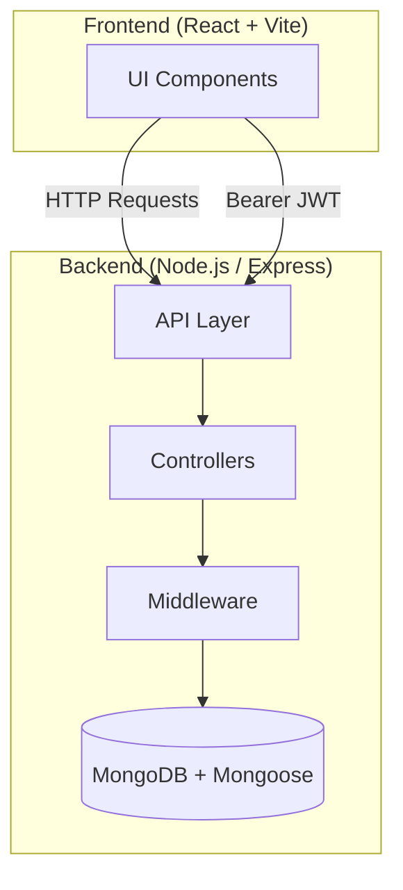
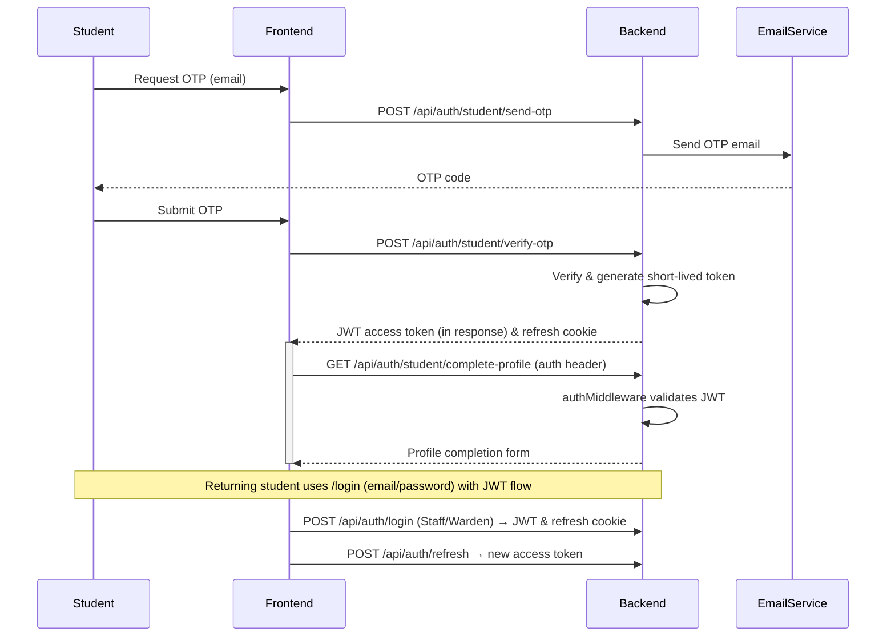
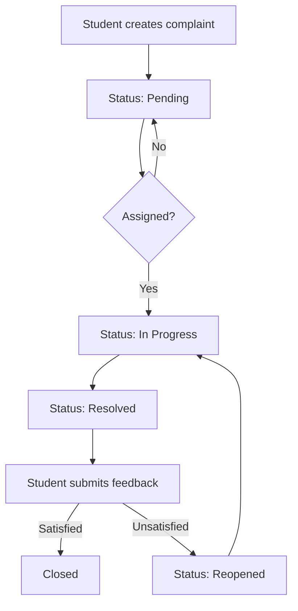

# Hostel Management System

[](https://reactjs.org/)
[](https://vitejs.dev/)
[](https://nodejs.org/)
[](https://expressjs.com/)
[](https://www.mongodb.com/atlas)
[](https://github.com/Antariksh62/Hostel-Management-System/blob/main/LICENSE)
[](https://github.com/Antariksh62/Hostel-Management-System/commits/main)
[](https://github.com/Antariksh62/Hostel-Management-System/stargazers)
[](https://github.com/Antariksh62/Hostel-Management-System/network)

---

## Table of Contents
- [Project Overview](#project-overview)
- [Highlights](#highlights)
- [Current Project Status](#current-project-status)
- [System Architecture](#system-architecture)
- [Authentication Flow](#authentication-flow)
- [Complaint Workflow](#complaint-workflow)
- [Tech Stack](#tech-stack)
- [Features](#features)
- [Folder Structure](#folder-structure)
- [Installation & Running Locally](#installation--running-locally)
- [Environment Variables](#environment-variables)
- [API Documentation](#api-documentation)
- [Security](#security)
- [Screenshots](#screenshots)
- [Deployment](#deployment)
- [Contributing](#contributing)
- [Future Scope](#future-scope)
- [Roadmap](#roadmap)
- [Version](#version)
- [License](#license)

---

## Project Overview

**Hostel Management System** is a full‑stack MERN application designed to streamline complaint handling for the PICT hostel. It provides a unified platform for **students**, **staff**, **wardens**, and senior **incharge** personnel to create, track, and resolve accommodation‑related issues.

- **Problem it solves**: Reduces manual paperwork, improves communication between residents and hostel administration, and offers real‑time visibility into complaint status.
- **Target audience**: Students living in the hostel, support staff responsible for maintenance, wardens overseeing operations, and senior administrators who need analytics.
- **Major goals**: Secure authentication, role‑based access, complete complaint lifecycle tracking, media‑rich reporting, and actionable analytics.
- **Current development status**: This project is currently in the development phase.

---

## Highlights

| ✅ | Feature |
|---|---------|
| ✅ | **OTP Authentication** – secure one‑time‑password flow for students |
| ✅ | **Role‑Based Access Control** – granular middleware for Staff, Warden, Incharge |
| ✅ | **JWT Authentication** with short‑lived access tokens and HTTP‑only refresh cookies |
| ✅ | **Complaint Lifecycle Tracking** – from creation to resolution, including feedback loop |
| ✅ | **Analytics Dashboard** – status breakdown, category trends, average resolution time |
| ✅ | **Image & Video Upload** – up to 5 images + 1 video per complaint (Multer & file‑type validation) |
| ✅ | **Timeline View** – chronological visualisation of complaint history |
| ✅ | **Responsive UI** – built with React 19 & Vite, works on desktop & mobile browsers |
| ✅ | **Theme Support** – dark/light mode toggle |
| ✅ | **Dashboard Statistics** – reusable stats cards & charts (Recharts) |
| ✅ | **Secure APIs** – Helmet, rate limiting, Joi validation, bcrypt password hashing |

---

## Current Project Status

**Implemented Modules**
- ✅ Authentication (OTP, JWT, Refresh)
- ✅ Complaint Management (CRUD, status workflow, feedback)
- ✅ Media Upload (images & video, validation)
- ✅ Analytics (dashboard, API aggregation)
- ✅ Role‑Based Dashboards (Student, Staff, Warden, Incharge)
- ✅ Notification via email (OTP delivery)
- ✅ Secure middleware (Helmet, rate limiting, Joi)

**Planned / In‑Progress Modules**
- 🚧 Room Management (allocation & tracking)
- 🚧 Real‑time Notifications (WebSocket / Push)
- 🚧 AI‑powered Prioritisation & Chatbot
- 🚧 Automated Testing & CI/CD pipeline
- 🚧 Mobile‑friendly PWA wrapper

---

## System Architecture


## Authentication Flow



---

## Complaint Workflow



---

## Tech Stack

| Layer | Technology | Version |
|-------|------------|---------|
| **Frontend** | React | 19.2.4 |
| | Vite | 8.0.1 |
| | React Router | 7.14.0 |
| | TanStack Query | 5.100.10 |
| | Recharts | 3.8.1 |
| **Backend** | Node.js | 20 |
| | Express | 5.2.1 |
| **Database** | MongoDB | Latest |
| **ODM** | Mongoose | 9.4.1 |
| **Authentication** | JSON Web Token | 9.0.3 |
| **Validation** | Joi | 18.1.2 |
| **File Uploads** | Multer | 2.1.1 |
| **Email** | Nodemailer | 8.0.5 |
| **Security** | Helmet | 8.1.0 |
| | express-rate-limit | 8.3.2 |
| | bcryptjs | 3.0.3 |

---

## Features

### Authentication
- OTP generation & verification for students (`otpController.js`)
- Email/password login for staff & wardens (`authController.js`)
- JWT access tokens (15 min) & HTTP‑only refresh token cookies
- Automatic token refresh endpoint (`/refresh`)
- Role‑based middleware (`auth.js`, `authMiddleware.js`)

### Complaint Management
- Create, view, update, assign, delete complaints (`complaintController.js`)
- Status workflow: Pending → In Progress → Resolved → Reopened
- Feedback submission with optional media for unsatisfied students
- Timeline/history tracking for every state change

### Media Handling
- Multer configuration for multi‑field uploads (`images`, `video`)
- File‑type validation using `file-type`
- Secure deletion of media on complaint removal

### Dashboards & UI
- Role‑specific dashboards (Student, Staff, Warden, Incharge)
- Analytics visualisation (status summary, trends, KPI cards)
- Timeline component (`ComplaintTimeline.jsx`) showing chronological events
- Media gallery (`MediaGallery.jsx`) with lightbox preview
- Theme toggle (dark/light) (`ThemeToggle.jsx`)
- Reusable stats cards (`StatsCard.jsx`) and charts (`Chart.jsx`)

### Analytics
- Aggregated statistics endpoint (`getAnalytics`)
- Daily trend, category breakdown, average resolution time
- Incharge‑level KPI endpoints (heatmaps, predictive insights, kanban board)

### User Management
- Profile retrieval (`userController.js`)
- List all students/users for admin purposes

### Security
- Helmet HTTP headers
- Express rate limiting on auth & OTP routes
- Input validation via Joi schemas (`validate.js`)
- Password hashing with bcryptjs
- Secure OTP expiry handling in `otpController.js`

---

## Folder Structure

```
Hostel-Management-System/
├─ backend/                # Express server
│  ├─ config/              # DB connection (db.js)
│  ├─ controllers/         # auth, complaint, otp, user, inchargeDashboard
│  ├─ middleware/          # auth, rateLimiter, upload, validate
│  ├─ models/              # User, Complaint, OTP, Announcement, Room
│  ├─ routes/              # authRoutes.js, complaintRoutes.js, userRoutes.js, inchargeRoutes.js
│  ├─ utils/               # generateTokens.js, logger.js
│  └─ server.js
├─ frontend-react/         # Vite + React SPA
│  ├─ src/
│  │  ├─ assets/           # images, icons
│  │  ├─ components/       # UI components (Sidebar, ThemeToggle, Chart, StatsCard, MediaGallery, ComplaintTimeline, ProtectedRoute, incharge/*)
│  │  ├─ context/          # React context providers
│  │  ├─ hooks/            # custom hooks (useInchargeDashboard.js, etc.)
│  │  ├─ pages/            # Dashboard pages per role
│  │  ├─ services/         # API wrappers (axios instances)
│  │  ├─ utils/            # helper utilities (exportUtils.js)
│  │  └─ App.jsx, main.jsx, index.css
│  ├─ public/              # static files
│  ├─ vite.config.js
│  └─ package.json
├─ .env.example            # template for environment variables
├─ README.md
└─ graphify-out/           # knowledge‑graph artifacts
```

---

## Installation & Running Locally

1. **Prerequisites**: Node ≥20, npm, MongoDB (local or Atlas).
2. **Clone the repo**
   ```bash
   git clone https://github.com/Antariksh62/Hostel-Management-System.git
   cd Hostel-Management-System
   ```
3. **Backend setup**
   ```bash
   cd backend
   cp .env.example .env   # edit with your values
   npm install
   npm run dev   # starts on PORT (default 5000)
   ```
4. **Frontend setup**
   ```bash
   cd ../frontend-react
   npm install
   npm run dev   # Vite dev server → http://localhost:5173
   ```

---

## Environment Variables (`backend/.env`)

| Variable | Description |
|----------|-------------|
| `MONGO_URI` | MongoDB connection string |
| `JWT_SECRET` | Secret for signing access tokens |
| `JWT_REFRESH_SECRET` | Secret for signing refresh tokens |
| `PORT` | Port for the Express server (default 5000) |
| `EMAIL_USER` | Gmail address used to send OTP emails |
| `EMAIL_PASS` | App‑specific password for the Gmail account |

---

## API Documentation

### Authentication
- `POST /api/auth/register` – staff/warden registration (email & password)
- `POST /api/auth/login` – staff/warden login, returns access token & refresh cookie
- `POST /api/auth/refresh` – refresh access token using HTTP‑only cookie
- `POST /api/auth/student/send-otp` – request OTP for student email
- `POST /api/auth/student/verify-otp` – verify OTP, receive temp token
- `POST /api/auth/student/complete-profile` – set name, password, role after OTP verification

### Student
- `PATCH /api/auth/student/update-info` – update student details (protected)

### Complaints
- `POST /api/complaints/` – create complaint (media upload) – Student only
- `GET /api/complaints/my-complaints` – list own complaints – Student only
- `GET /api/complaints/all` – list all complaints – Warden/Staff
- `PUT /api/complaints/:id/status` – update status – Staff/Warden
- `PUT /api/complaints/assign/:id` – assign staff – Warden only
- `DELETE /api/complaints/:id` – delete complaint – Warden only
- `POST /api/complaints/:id/feedback` – submit feedback with optional media – Student only
- `GET /api/complaints/analytics?days=7` – aggregated analytics for dashboards

### User Management
- `GET /api/user/profile` – retrieve own profile
- `GET /api/user/all-students` – list all student users (admin)
- `GET /api/user/all` – list all users (admin)

### Incharge (Senior Management)
- Various analytics endpoints (`/overview`, `/complaint-analytics`, `/staff-performance`, etc.)
- Announcement management (`GET /announcements`, `POST /announcements`, `DELETE /announcements/:id`)

All protected routes require the `Authorization: Bearer <token>` header and appropriate role middleware.

---

## Security

- **JWT Authentication** – short‑lived access tokens (15 min) + refresh tokens stored in HTTP‑only cookies.
- **Role‑Based Authorization** – `authMiddleware`, `wardenMiddleware`, `wardenOrStaffMiddleware`, and senior‑only checks for Incharge routes.
- **Helmet** – sets secure HTTP headers.
- **Rate Limiting** – limits on auth and OTP endpoints to mitigate brute‑force attacks.
- **Joi Validation** – request payload validation for all endpoints.
- **Password Hashing** – bcryptjs with salts.
- **OTP Expiry & Attempt Limits** – OTPs expire after a configurable period; verification attempts are rate‑limited.
- **Secure File Upload Validation** – MIME type checking using `file-type` before persisting uploads.

---

## Screenshots

🚧 Screenshots will be added soon.


## Deployment

### Recommended Deployment

Frontend: Vercel

Backend: Render

Database: MongoDB Atlas

Deployment configuration is planned but not yet completed.
- **Environment Variables** – all secrets (`JWT_SECRET`, `EMAIL_USER`, etc.) must be set in the hosting environment.
- **Current state** – No CI/CD pipeline is configured yet; deployment scripts will be added in future iterations.

---

## Future Scope

- **Room Allocation Module** – manage room assignments and availability.
- **Real‑time Notifications** – WebSocket / Push notifications for status updates.
- **AI Complaint Prioritization** – machine‑learning model to rank urgent issues.
- **AI Chatbot** – assist students with common queries.
- **Comprehensive Reporting** – PDF/CSV export of analytics.
- **Mobile Application** – React Native or Flutter client.
- **CI/CD Automation** – GitHub Actions for lint, test, build, and deploy.
- **Automated Testing** – Jest/Supertest unit and integration tests.

---

## Roadmap

### Planned Features
- Unit & integration tests (Jest, Supertest).
- Docker Compose for local development.
- Enhanced role management for Incharge.
- Push notifications for complaint updates.
- Exportable reports (CSV/PDF).

### AI Features
- Natural‑language summarisation of complaint details.
- Automated image classification for triage.

### Quality Improvements
- Refactor isolated utilities into shared services.
- TypeScript migration for stronger typing.
- Swagger/OpenAPI documentation.

### Deployment Improvements
- GitHub Actions CI workflow.
- Deploy frontend to Vercel, backend to Render.
- HTTPS and environment‑specific configuration.

---


## Status
🚧 Under Active Development

---

## License

MIT License – see the [LICENSE](LICENSE) file for details.
